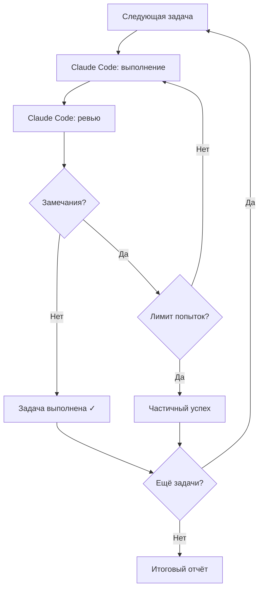

# Ralph

Ralph — CLI-инструмент для автономного выполнения задач разработки через Claude Code. Ralph читает список задач из `sprint-tasks.md`, запускает для каждой задачи сессию Claude Code, а затем автоматически проверяет результат через цикл «выполнение → ревью».

## Возможности

- **Автоматическое выполнение** — запускает Claude Code для каждой задачи из `sprint-tasks.md`
- **Встроенный код-ревью** — отдельная сессия-ревьюер проверяет результат каждой задачи
- **Цикл повторов** — при замечаниях ревьюера задача переделывается (до `max_iterations` раз)
- **Накопление знаний** — извлекает уроки в `LEARNINGS.md` и автоматически сжимает их
- **Human Gates** — точки ручного контроля с возможностью обратной связи
- **Observability** — трекинг токенов, стоимости, latency, diff-статистики и итоговый отчёт
- **Защита бюджета** — предупреждения и аварийная остановка при превышении лимита расходов
- **Детект зависания** — обнаружение повторяющихся безрезультатных итераций
- **Детект дубликатов** — Jaccard similarity для обнаружения одинаковых промптов

## Требования

- [Claude Code](https://claude.ai/code) установлен и настроен (`claude` в PATH)
- Go 1.25+ (только для сборки из исходников)

## Установка

### Через `go install`

```bash
go install github.com/bmad-ralph/bmad-ralph/cmd/ralph@latest
```

### Из исходников

```bash
git clone https://github.com/bmad-ralph/bmad-ralph.git
cd bmad-ralph
make build
# Бинарник: ./ralph
```

## Быстрый старт

### 1. Подготовьте задачи через `bridge`

Конвертируйте BMad story-файлы в `sprint-tasks.md`:

```bash
ralph bridge docs/sprint-artifacts/story-1.1.md docs/sprint-artifacts/story-1.2.md
```

Или создайте `sprint-tasks.md` вручную:

```markdown
## Tasks

- [ ] Реализовать аутентификацию пользователей
- [ ] Добавить юнит-тесты для пакета auth
- [ ] Обновить README с примерами API
```

### 2. Запустите цикл выполнения

```bash
ralph run
```

Ralph выполняет каждую задачу по очереди, проверяет результат и сообщает об итогах.

### 3. Следите за прогрессом

Логи сохраняются в `.ralph/logs/`. Прогресс задач отображается в `sprint-tasks.md` (чекбоксы `- [x]`). По завершении выводится итоговый отчёт с метриками.

## Команды

| Команда | Описание |
|---------|----------|
| `ralph run` | Запустить цикл выполнения задач из `sprint-tasks.md` |
| `ralph bridge <files...>` | Конвертировать BMad story-файлы в `sprint-tasks.md` |
| `ralph distill` | Вручную запустить сжатие `LEARNINGS.md` |

Подробнее: `ralph <команда> --help`

## Цикл выполнения `ralph run`

Для каждой открытой задачи (`- [ ]`) в `sprint-tasks.md`:



На каждом шаге Ralph:

1. Собирает промпт из шаблона + контекст задачи + накопленные знания
2. Запускает `claude` subprocess с промптом
3. Парсит JSON-вывод (токены, модель, код завершения)
4. Проверяет git diff (новые строки, удалённые строки, затронутые файлы)
5. Запускает ревью-сессию с 5 специализированными суб-агентами
6. Записывает метрики: стоимость, latency, diff stats, findings

## Конфигурация

Создайте `.ralph/config.yaml` в корне проекта:

```yaml
# Ограничения выполнения
max_turns: 50               # Максимум ходов Claude на задачу
max_iterations: 3           # Максимум повторов при замечаниях ревью
max_review_iterations: 3    # Максимум циклов ревью

# Модели
model_execute: ""           # Модель для выполнения (пусто = default Claude)
model_review: ""            # Модель для ревью (пусто = default Claude)

# Ревью
review_every: 1             # Проверять каждые N задач
review_min_severity: "LOW"  # Минимальная серьёзность для повтора

# Human Gates
gates_enabled: false        # Включить интерактивные остановки
gates_checkpoint: 0         # Checkpoint каждые N задач (0 = выкл.)

# Управление знаниями
learnings_budget: 200       # Лимит строк в LEARNINGS.md
distill_cooldown: 5         # Минимум задач между автодистилляциями
distill_timeout: 120        # Таймаут дистилляции в секундах
always_extract: false       # Извлекать знания после каждой задачи

# Observability
stuck_threshold: 2          # Число итераций без коммита → feedback injection
similarity_window: 0        # Окно истории для детекта дубликатов (0 = выкл.)
similarity_warn: 0.85       # Порог предупреждения (Jaccard)
similarity_hard: 0.95       # Порог аварийного пропуска (Jaccard)
budget_max_usd: 0           # Лимит расходов в USD (0 = без лимита)
budget_warn_pct: 80         # Процент бюджета для предупреждения

# Прочее
log_dir: ".ralph/logs"      # Директория логов
stories_dir: "docs/sprint-artifacts"  # Директория story-файлов
```

Флаги командной строки перекрывают config-файл:

```bash
ralph run --gates --max-turns 30 --model claude-opus-4-6
```

Каскад приоритетов: CLI флаги > `.ralph/config.yaml` > встроенные умолчания.

## Human Gates

Human Gates — точки ручного контроля, где Ralph ждёт вашего решения.

### Включение

```bash
ralph run --gates
```

### Типы

- **Task Gate** — остановка перед задачей с тегом `[GATE]`:
  ```markdown
  - [ ] [GATE] Деплой на production
  ```
- **Checkpoint Gate** — автоматическая остановка каждые N задач:
  ```bash
  ralph run --gates --every 3
  ```
- **Emergency Gate** — автоматическая остановка при исчерпании попыток или превышении бюджета

### Действия

```
[Gate] Выполнено 3 задачи. Продолжить?
  [c] Продолжить
  [s] Пропустить следующую задачу
  [f] Добавить обратную связь для следующей задачи
  [q] Выйти
```

## Управление знаниями

Ralph накапливает уроки из ревью в `LEARNINGS.md`:

```markdown
## testing: assertion-quality [review, runner/test.go:42]

При проверке множественных вхождений используй strings.Count >= N,
не просто strings.Contains.
```

- **Мягкий лимит** (150 строк) — сигнал для автодистилляции
- **Жёсткий лимит** (200 строк) — настраивается через `learnings_budget`
- **`ralph distill`** — ручной запуск сжатия вне основного цикла

## Observability и метрики

Ralph собирает метрики на каждом шаге выполнения и выводит итоговый отчёт по завершении.

### Что отслеживается

| Метрика | Описание |
|---------|----------|
| Токены (input/output/cache) | Расход токенов по каждой сессии Claude |
| Стоимость (USD) | Расчёт на основе таблицы цен моделей |
| Diff stats | Файлы изменены, строки добавлены/удалены, затронутые пакеты |
| Review findings | Количество и серьёзность замечаний (CRITICAL/HIGH/MEDIUM/LOW) |
| Latency | Время каждой фазы: session, git, gate, review, distill |
| Gate analytics | Количество промптов, approvals, rejections, skips, время ожидания |
| Категоризация ошибок | Классификация по типу: timeout, parse, git, session, config, unknown |

### Stuck Detection

Если Ralph не находит новых коммитов `stuck_threshold` итераций подряд, он автоматически инжектирует обратную связь в следующую попытку:

```yaml
stuck_threshold: 2  # после 2 итераций без коммита
```

### Similarity Detection

Детект одинаковых промптов через Jaccard similarity (сравнение токен-множеств):

```yaml
similarity_window: 5    # хранить 5 последних промптов
similarity_warn: 0.85   # предупреждение при схожести >85%
similarity_hard: 0.95   # пропуск задачи при схожести >95%
```

При `similarity_window: 0` детекция отключена.

### Budget Alerts

Контроль расходов с двумя порогами:

```yaml
budget_max_usd: 10.0   # максимальный бюджет в USD
budget_warn_pct: 80     # предупреждение на 80% бюджета
```

- На `budget_warn_pct` — предупреждение в логе
- На 100% — аварийная остановка через emergency gate (при включённых gates) или пропуск задач

При `budget_max_usd: 0` контроль бюджета отключён.

### Итоговый отчёт

По завершении `ralph run` выводится цветной отчёт:

```
=== Ralph Run Summary ===
Run ID: abc123
Tasks: 5 completed, 0 failed, 1 skipped
Tokens: 125,000 input / 45,000 output / 10,000 cache
Cost: $2.34
Sessions: 12
```

Метрики также записываются в JSON-формате в лог-файл для программного анализа.

### Cost Tracking

Ralph рассчитывает стоимость каждой сессии на основе встроенной таблицы цен. Если модель неизвестна, используется самая дорогая из таблицы (conservative estimate). Стоимость отображается в gate-промптах для информированного принятия решений.

## Код-ревью

Ralph запускает ревью-сессию после каждой задачи (настраивается через `review_every`). Ревью использует 5 специализированных суб-агентов:

| Агент | Область проверки |
|-------|-----------------|
| Quality | Качество кода, DRY, KISS |
| Implementation | Соответствие задаче и AC |
| Simplification | Лишний код, over-engineering |
| Design Principles | SRP, архитектура |
| Test Coverage | Покрытие тестами, edge cases |

Замечания парсятся по серьёзности (`### [SEVERITY] Description`) и сохраняются в `review-findings.md`. Счётчик замечаний отслеживается в метриках для каждой задачи.

## Коды завершения

| Код | Значение |
|-----|----------|
| 0 | Все задачи выполнены успешно |
| 1 | Частичный успех (превышен лимит итераций) |
| 2 | Пользователь прервал через Human Gate |
| 3 | Прервано сигналом (Ctrl+C) |
| 4 | Фатальная ошибка |

## Архитектура

```
cmd/ralph/          CLI (Cobra): run, bridge, distill
├── runner/         Основной цикл: execute → review → knowledge
│   ├── metrics.go  MetricsCollector, RunMetrics, TaskMetrics
│   ├── similarity.go SimilarityDetector (Jaccard)
│   └── prompts/    Go-шаблоны промптов
├── bridge/         Конвертер story → sprint-tasks.md
├── session/        Subprocess claude CLI + JSON parsing
├── gates/          Human Gates (stdin/stdout I/O)
└── config/         Leaf-пакет: Config, Load(), Pricing
```

Зависимости строго однонаправленные: `cmd/ralph → runner → session, gates, config`.

## Документация

- [Руководство пользователя](docs/user-guide.md) — подробное описание всех возможностей
- [Руководство разработчика](docs/developer-guide.md) — архитектура, тестирование, вклад в проект
- [Контекст проекта](docs/project-context.md) — архитектурные решения для AI-агентов

## Лицензия

MIT
