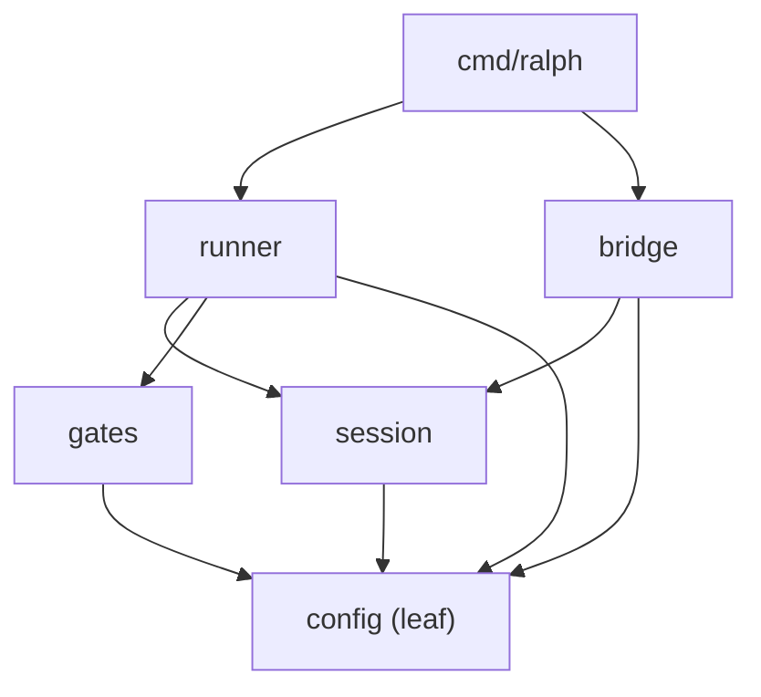
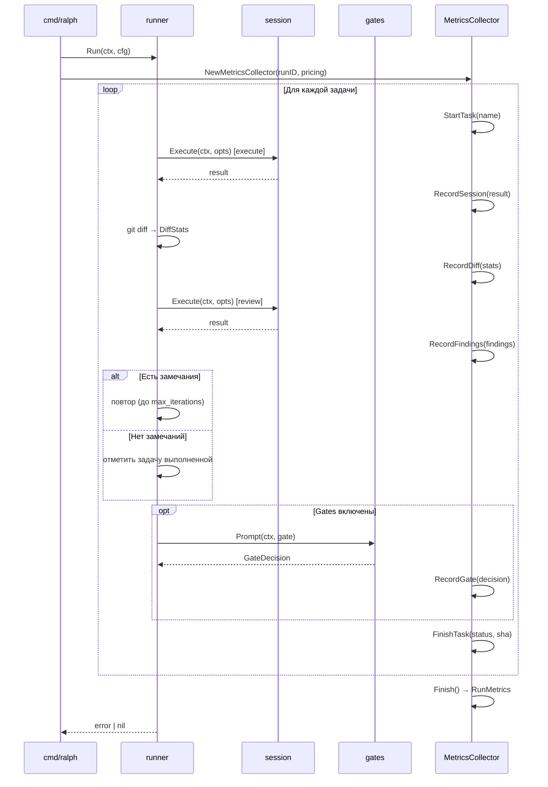

# Руководство разработчика Ralph

Это руководство для тех, кто хочет разобраться в архитектуре Ralph, запустить тесты, добавить новую функциональность или внести вклад в проект.

## Содержание

- [Настройка окружения](#настройка-окружения)
- [Структура проекта](#структура-проекта)
- [Архитектура](#архитектура)
- [Конфигурация](#конфигурация)
- [Тестирование](#тестирование)
- [Сборка и релиз](#сборка-и-релиз)
- [Стиль кода](#стиль-кода)
- [Добавление новой функциональности](#добавление-новой-функциональности)

---

## Настройка окружения

### Требования

- **Go 1.25+**
- **golangci-lint** (только для запуска линтера локально)
- **Git**

### Клонирование и сборка

```bash
git clone https://github.com/bmad-ralph/bmad-ralph.git
cd bmad-ralph
make build
./ralph --help
```

### Запуск тестов

```bash
make test
# Или напрямую:
go test ./...
```

### Запуск линтера

```bash
make lint
# Или:
golangci-lint run
```

> **WSL/Windows:** если используете WSL с Windows Go, используйте полный путь:
> `"/mnt/c/Program Files/Go/bin/go.exe" test ./...`

---

## Структура проекта

```
bmad-ralph/
├── cmd/ralph/          # Точка входа CLI (Cobra команды)
│   ├── main.go         # Инициализация, обработка сигналов
│   ├── run.go          # Команда `ralph run`
│   ├── bridge.go       # Команда `ralph bridge`
│   ├── distill.go      # Команда `ralph distill`
│   └── exit.go         # Коды завершения
│
├── runner/             # Основной цикл выполнения
│   ├── runner.go       # Execute() — цикл задача-ревью
│   ├── git.go          # GitClient interface + реализация
│   ├── scan.go         # Парсинг sprint-tasks.md
│   ├── prompt.go       # Сборка промптов
│   ├── metrics.go      # MetricsCollector, RunMetrics, TaskMetrics
│   ├── similarity.go   # SimilarityDetector (Jaccard)
│   ├── log.go          # RunLogger (runID, файловый лог)
│   ├── knowledge*.go   # Управление LEARNINGS.md
│   ├── knowledge_distill.go  # Дистилляция знаний
│   ├── serena.go       # Детект Serena MCP
│   └── prompts/        # Go-шаблоны промптов (*.md)
│
├── bridge/             # Конвертер story → sprint-tasks.md
│   ├── bridge.go
│   └── prompts/
│
├── session/            # Выполнение Claude Code subprocess
│   ├── session.go      # Execute() — запуск claude CLI
│   └── result.go       # Парсинг JSON-вывода Claude
│
├── gates/              # Human Gates (интерактивные остановки)
│   └── gates.go
│
├── config/             # Конфигурация (leaf-пакет)
│   ├── config.go       # Load(), Config struct, CLIFlags
│   ├── constants.go    # Строковые константы и regex
│   ├── defaults.yaml   # Встроенные умолчания (embed)
│   ├── errors.go       # Sentinel errors, ExitCodeError
│   ├── pricing.go      # Pricing struct, DefaultPricing, MergePricing
│   └── prompt.go       # Шаблонизатор промптов
│
└── internal/
    └── testutil/       # Тестовая инфраструктура (mock Claude)
```

---

## Архитектура

### Направление зависимостей

Зависимости строго однонаправленные (циклы запрещены):



Правило: пакет нижнего уровня **не знает** о пакете, который его использует.

### Ключевые решения

**`config` — leaf-пакет.** Не импортирует ничего из проекта. Все пакеты зависят от него, но не наоборот.

**Exit codes только в `cmd/ralph/`.** Пакеты возвращают `error`, никогда не вызывают `os.Exit`.

**Двухэтапная сборка промптов.** Защита от template injection при работе с пользовательскими файлами:

1. `text/template` — для структуры промпта (`{{if .GatesEnabled}}`)
2. `strings.Replace` — для вставки user-контента (`LEARNINGS.md`, `CLAUDE.md`)

Пользовательские файлы могут содержать `{{` — `text/template` упал бы на них. Двухэтапность защищает от этого.

**`config.Config` неизменяем в runtime.** Парсится один раз при старте, передаётся по указателю, никогда не мутируется.

**Интерфейсы в пакете-потребителе.** `GitClient` определён в `runner/`, а не в отдельном `git/` пакете.

### Observability (MetricsCollector)

`MetricsCollector` — nil-safe injectable struct в `runner/metrics.go`. Инжектируется через поле `Runner.Metrics`. Если `nil` — все методы работают как no-op (ни одна проверка `if mc != nil` не нужна в вызывающем коде).

**Жизненный цикл:**

```
NewMetricsCollector(runID, pricing)
  → StartTask(name)
    → RecordSession(result)    // токены, стоимость, latency
    → RecordDiff(stats)        // git diff --stat
    → RecordFindings(findings) // review findings
    → RecordGate(decision)     // gate analytics
    → RecordError(category)    // классификация ошибок
  → FinishTask(status, commitSHA)
→ Finish() → RunMetrics
```

Правило: `StartTask` всегда имеет парный `FinishTask` на всех code paths (включая error paths).

**Ключевые типы:**

| Тип | Файл | Назначение |
|-----|-------|-----------|
| `MetricsCollector` | `runner/metrics.go` | Сборщик метрик (nil-safe) |
| `RunMetrics` | `runner/metrics.go` | Итоговые метрики запуска (JSON-сериализуемые) |
| `TaskMetrics` | `runner/metrics.go` | Метрики одной задачи |
| `DiffStats` | `runner/metrics.go` | Статистика git diff (файлы, строки, пакеты) |
| `SimilarityDetector` | `runner/similarity.go` | Jaccard similarity с скользящим окном |
| `Pricing` | `config/pricing.go` | Цены моделей (input/output/cache per 1M) |

**SimilarityDetector** (`runner/similarity.go`) хранит скользящее окно промптов и вычисляет Jaccard similarity между текущим и предыдущими. Два порога: `warnAt` (предупреждение) и `hardAt` (аварийный пропуск). Инжектируется через `Runner.Similarity`.

**Pricing** (`config/pricing.go`) — таблица цен моделей. `DefaultPricing` содержит встроенные цены. `MergePricing` позволяет перекрыть пользовательскими ценами. `MostExpensiveModel` используется для conservative estimate при неизвестной модели.

### Инъекция зависимостей (Runner struct)

`Runner` использует function injection для тестируемости. Все зависимости — public поля:

```go
type Runner struct {
    Cfg                  *config.Config
    Git                  GitClient              // interface
    TasksFile            string
    ReviewFn             ReviewFunc             // func(ctx, cfg, ...) error
    GatePromptFn         GatePromptFunc         // func(ctx, gate) GateDecision
    EmergencyGatePromptFn GatePromptFunc
    ResumeExtractFn      ResumeExtractFunc
    DistillFn            DistillFunc
    SleepFn              func(time.Duration)
    Knowledge            KnowledgeWriter        // interface
    CodeIndexer          CodeIndexer            // interface (Serena MCP)
    Logger               *RunLogger
    Metrics              *MetricsCollector      // nil = no-op
    Similarity           *SimilarityDetector    // nil = отключён
}
```

В тестах подставляются mock-функции/структуры. В продакшене — реальные реализации из `cmd/ralph/run.go`.

### Поток выполнения `ralph run`



---

## Конфигурация

### Трёхуровневый каскад

```
CLI флаги  >  .ralph/config.yaml  >  embedded defaults.yaml
```

Реализован в `config/config.go`:

- `defaultConfig()` — парсит встроенный `defaults.yaml`
- `Load(flags)` — читает `.ralph/config.yaml`, применяет CLI флаги
- `applyCLIFlags()` — применяет только непустые (non-nil) флаги

### Обнаружение корня проекта

`detectProjectRootFrom()` поднимается вверх по директориям:

1. Ищет `.ralph/` (наивысший приоритет)
2. Ищет `.git/` (fallback)
3. Возвращает текущую директорию как последний fallback

### Sentinel errors

Определены в `config/errors.go`:

```go
var (
    ErrMaxRetries      = errors.New("max retries exceeded")
    ErrMaxReviewCycles = errors.New("max review cycles exceeded")
    ErrNoTasks         = errors.New("no tasks")
    ErrNoRecovery      = errors.New("dirty state: no recovery possible")
)
```

Добавляйте новые sentinel errors в `config/errors.go`, а не в пакетах-потребителях.

---

## Тестирование

### Философия

- **Table-driven тесты** по умолчанию
- **Go stdlib** для assertions (без testify)
- **`t.TempDir()`** для изоляции файловой системы
- **Покрытие** `runner` и `config` >80%

### Запуск тестов с покрытием

```bash
go test ./... -coverprofile=coverage.out
go tool cover -html=coverage.out -o coverage.html
```

### Mock Claude

Ralph использует паттерн self-reexec для мока Claude в тестах. Тесты не вызывают реальный `claude`, вместо этого бинарник теста переиспользуется как mock.

Сценарии мока определяются через `config.ClaudeCommand`:

```go
// В тесте:
cfg.ClaudeCommand = testutil.MockClaudeBinary(t, scenarios)
```

Сценарии — это упорядоченные JSON-ответы, имитирующие Claude API.

### Mock Git

```go
type GitClient interface {
    HeadCommit() (string, error)
    HealthCheck() error
}

// Реализации:
// - ExecGitClient — продакшен (вызывает git)
// - MockGitClient — тесты (настраиваемые ответы)
```

### Именование тестов

```
Test<Type>_<Method>_<Scenario>
```

где `Type` — реальное Go имя типа или экспортируемой переменной:

```go
func TestConfig_Load_MissingFile(t *testing.T) {...}
func TestRunner_Execute_WithFindings(t *testing.T) {...}
func TestGitClient_HeadCommit_EmptyRepo(t *testing.T) {...}
```

### Паттерны проверки ошибок

```go
// Всегда проверяйте содержимое ошибки, а не только её наличие:
if !strings.Contains(err.Error(), "expected prefix") {
    t.Errorf("got error %q, want containing %q", err, "expected prefix")
}

// Используйте errors.As вместо type assertions:
var exitErr *config.ExitCodeError
if !errors.As(err, &exitErr) {
    t.Fatalf("expected ExitCodeError, got %T", err)
}
```

### Golden files

Для тестирования сложного вывода используйте golden files:

```go
// Обновление: go test -update
// Проверка: go test (без флага)
```

Файлы хранятся в `testdata/TestName.golden`.

---

## Сборка и релиз

### Локальная сборка

```bash
make build        # Сборка бинарника ./ralph
make test         # Запуск тестов
make lint         # Линтинг
make clean        # Удаление бинарника
```

### CI/CD

GitHub Actions (`go 1.25` matrix):

- `go test ./...` — тесты
- `golangci-lint run` — линтинг (7 linters)

### Релиз (goreleaser)

Конфигурация в `.goreleaser.yaml`:

- Платформы: linux, darwin
- Архитектуры: amd64, arm64
- `CGO_ENABLED=0` — статическая сборка

---

## Стиль кода

### Обёртка ошибок

**Всегда** оборачивайте ошибки с контекстом. **Все** `return err` в функции должны оборачивать:

```go
// ✓ Правильно
func loadData(path string) error {
    data, err := os.ReadFile(path)
    if err != nil {
        return fmt.Errorf("runner: load data: %w", err)
    }
    if err := parse(data); err != nil {
        return fmt.Errorf("runner: load data: parse: %w", err)
    }
    return nil
}

// ✗ Неправильно — некоторые return не оборачивают
func loadData(path string) error {
    data, err := os.ReadFile(path)
    if err != nil {
        return err  // потеряли контекст!
    }
    ...
}
```

### Doc comments

Doc comment должен **точно** описывать поведение функции. После рефакторинга обязательно обновляйте комментарии.

### Возвращаемые значения

Никогда не отбрасывайте возвращаемые значения молча:

```go
// ✓ Явное игнорирование с объяснением
_, _ = fmt.Fprintf(w, msg) // best-effort log, error irrelevant

// ✗ Неявное игнорирование — ошибка теряется
session.ParseResult(raw, elapsed)
```

### Импорт интерфейсов

Определяйте интерфейсы в пакете-потребителе, а не в пакете-поставщике:

```go
// ✓ GitClient определён в runner/, использует его runner
// runner/git.go
type GitClient interface {
    HeadCommit() (string, error)
    HealthCheck() error
}
```

---

## Добавление новой функциональности

### Новая команда CLI

1. Создайте `cmd/ralph/mycommand.go` с `var myCmd = &cobra.Command{...}`
2. Зарегистрируйте в `init()` в `main.go`: `rootCmd.AddCommand(myCmd)`
3. Коды завершения — только в `exit.go`, пакеты возвращают `error`

### Новая опция конфигурации

1. Добавьте поле в `config.Config` с yaml-тегом (`config/config.go`)
2. Добавьте дефолтное значение в `config/defaults.yaml`
3. Добавьте поле в `config.CLIFlags` (если нужен CLI-флаг)
4. Добавьте обработку в `applyCLIFlags()` и в `init()` команды
5. Напишите тесты для нового поля в `config/config_test.go`

### Новый промпт

Промпты — это Go-шаблоны в `runner/prompts/` или `bridge/prompts/`:

```markdown
# Execute Prompt

{{if .GatesEnabled}}
Gate-specific instructions here.
{{end}}

Task: __TASK_CONTENT__
```

- `{{.Field}}` — для данных конфига (через `text/template`)
- `__PLACEHOLDER__` — для user-контента (через `strings.Replace`)

### Новый sentinel error

Добавляйте в `config/errors.go`, не в пакеты-потребители:

```go
var ErrMyNewCondition = errors.New("my: new condition")
```

После добавления обновите тест в `config/errors_test.go`.

### Зависимости

Проект намеренно минимален: **только 3 прямые зависимости** (cobra, yaml.v3, fatih/color). Добавление новой зависимости требует обоснования в PR.
