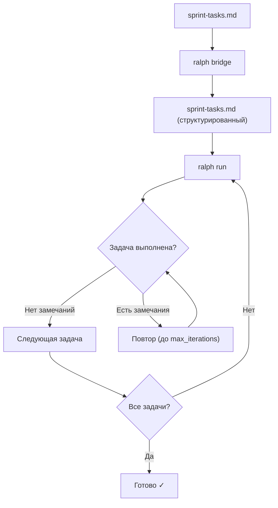

# Руководство пользователя Ralph

Ralph автоматизирует цикл «выполнение → ревью» для задач разработки через Claude Code. Это руководство описывает все возможности инструмента.

## Содержание

- [Установка](#установка)
- [Рабочий процесс](#рабочий-процесс)
- [Команда bridge](#команда-bridge)
- [Команда run](#команда-run)
- [Команда distill](#команда-distill)
- [Формат sprint-tasks.md](#формат-sprint-tasksmd)
- [Конфигурация](#конфигурация)
- [Human Gates](#human-gates)
- [Управление знаниями](#управление-знаниями)
- [Observability и метрики](#observability-и-метрики)
- [Коды завершения](#коды-завершения)
- [Устранение неполадок](#устранение-неполадок)

---

## Установка

### Требования

- **Claude Code** — установлен и доступен как `claude` в `$PATH`
- **Go 1.25+** — только для сборки из исходников

### Через `go install`

```bash
go install github.com/bmad-ralph/bmad-ralph/cmd/ralph@latest
```

### Через `make`

```bash
git clone https://github.com/bmad-ralph/bmad-ralph.git
cd bmad-ralph
make build
# Бинарник ./ralph появится в текущей директории
```

### Проверка установки

```bash
ralph --version
ralph --help
```

---

## Рабочий процесс

Ralph работает в три этапа:



1. **Подготовка** — создайте `sprint-tasks.md` вручную или через `ralph bridge`
2. **Выполнение** — `ralph run` запускает цикл автоматически
3. **Контроль** — используйте Human Gates для ручных проверок в ключевых точках

---

## Команда bridge

`bridge` конвертирует BMad story-файлы в структурированный `sprint-tasks.md`.

### Синтаксис

```bash
ralph bridge <story-file> [story-file...]
```

### Примеры

```bash
# Один файл
ralph bridge docs/sprint-artifacts/story-1.1.md

# Несколько файлов — задачи объединяются
ralph bridge docs/sprint-artifacts/story-2.1.md docs/sprint-artifacts/story-2.2.md
```

### Результат

Команда создаёт `sprint-tasks.md` в корне проекта и выводит количество открытых задач:

```
Generated 5 tasks in sprint-tasks.md
```

Если промпт получается слишком длинным (>1500 строк), Ralph выводит предупреждение:

```
Warning: large prompt (1823 lines) — consider splitting story
```

### Merge Mode

Если `sprint-tasks.md` уже существует, bridge автоматически переходит в режим слияния:

- Создаёт бекап `sprint-tasks.md.bak` перед любыми изменениями
- **Сохраняет** статусы уже выполненных задач (`- [x]`)
- **Добавляет** только новые задачи из обновлённого story-файла
- **Не дублирует** задачи, которые уже есть в файле

Это значит: если story обновилась после частичного выполнения, повторный `ralph bridge` добавит новые задачи, не трогая уже выполненные.

---

## Команда run

`run` запускает основной цикл выполнения задач.

### Синтаксис

```bash
ralph run [флаги]
```

### Флаги

| Флаг | По умолчанию | Описание |
|------|-------------|----------|
| `--max-turns N` | 50 | Максимум ходов Claude на одну задачу |
| `--gates` | false | Включить Human Gates |
| `--every N` | 0 (выкл.) | Checkpoint gate каждые N задач |
| `--model MODEL` | (из config) | Модель Claude для выполнения |
| `--always-extract` | false | Извлекать знания после каждой задачи |

### Примеры

```bash
# Базовый запуск
ralph run

# С включёнными Gates и кастомной моделью
ralph run --gates --model claude-opus-4-6

# Checkpoint каждые 3 задачи
ralph run --gates --every 3

# Ограничить ходы Claude
ralph run --max-turns 20
```

### Что делает ralph run

Для каждой открытой задачи (`- [ ]`) в `sprint-tasks.md`:

1. Запускает сессию Claude Code с промптом задачи
2. Claude выполняет задачу и делает git-коммит
3. Запускает сессию ревью через отдельный промпт
4. Если ревьюер обнаружил замечания — повторяет (до `max_iterations`)
5. Если замечаний нет — помечает задачу выполненной (`- [x]`) и переходит к следующей
6. При включённых Gates — ждёт подтверждения пользователя в ключевых точках

---

## Команда distill

`distill` вручную запускает сжатие `LEARNINGS.md` через Claude.

### Синтаксис

```bash
ralph distill
```

### Когда использовать

Ralph автоматически запускает дистилляцию во время `ralph run` при выполнении двух условий одновременно:

1. `LEARNINGS.md` достиг мягкого лимита (≥150 строк по умолчанию)
2. С последней дистилляции выполнено не менее `distill_cooldown` задач (по умолчанию 5)

`ralph distill` — ручной запуск. Используйте его, если хотите принудительно сжать знания вне основного цикла, например перед началом нового спринта.

### Процесс

1. Ralph читает `LEARNINGS.md`
2. Запускает Claude для структурирования и сжатия
3. Записывает результат обратно
4. При ошибке — предлагает повторить или отменить (с автовосстановлением)

```bash
ralph distill
# Distillation complete.
```

> **Внимание:** не запускайте `ralph distill` одновременно с `ralph run`.

---

## Формат sprint-tasks.md

`sprint-tasks.md` — основной файл управления задачами Ralph.

### Структура

```markdown
# Sprint Tasks

> Системный контекст и правила для Claude (необязательно)

## Tasks

- [ ] Первая открытая задача
- [x] Уже выполненная задача
- [ ] [GATE] Задача с Human Gate перед выполнением
- [ ] Ещё одна задача
```

### Элементы

| Элемент | Описание |
|---------|----------|
| `- [ ] Задача` | Открытая задача для выполнения |
| `- [x] Задача` | Выполненная задача (Ralph проставляет автоматически) |
| `- [ ] [GATE] Задача` | Задача с остановкой для ручного подтверждения |
| `> USER FEEDBACK: ...` | Обратная связь пользователя, передаётся Claude |

### Добавление контекста

Текст в начале файла (до раздела `## Tasks`) передаётся Claude как системный контекст:

```markdown
# Sprint Tasks

Работай строго по SOLID-принципам. Покрытие тестами >80%.
Используй только stdlib, без внешних зависимостей.

## Tasks

- [ ] Реализовать парсер конфигурации
```

---

## Конфигурация

Ralph использует трёхуровневый каскад конфигурации:

```
CLI флаги  >  .ralph/config.yaml  >  встроенные умолчания
```

### Файл конфигурации

Создайте `.ralph/config.yaml` в корне проекта:

```yaml
# Ограничения выполнения
max_turns: 50               # Максимум ходов Claude на задачу
max_iterations: 3           # Максимум повторов при замечаниях ревью
max_review_iterations: 3    # Максимум циклов ревью

# Модели
model_execute: ""           # Модель для выполнения (пусто = default Claude)
model_review: ""            # Модель для ревью (пусто = default Claude)

# Ревью
review_every: 1             # Проверять каждые N задач
review_min_severity: "LOW"  # Минимальная серьёзность для повтора (LOW/MEDIUM/HIGH)

# Human Gates
gates_enabled: false        # Включить интерактивные остановки
gates_checkpoint: 0         # Checkpoint каждые N задач (0 = выкл.)

# Управление знаниями
learnings_budget: 200       # Лимит строк в LEARNINGS.md
distill_cooldown: 5         # Минимум задач между автодистилляциями
distill_timeout: 120        # Таймаут дистилляции в секундах
always_extract: false       # Извлекать знания после каждой задачи

# Observability
stuck_threshold: 2          # Число итераций без коммита → feedback injection
similarity_window: 0        # Окно истории для детекта дубликатов (0 = выкл.)
similarity_warn: 0.85       # Порог предупреждения (Jaccard similarity)
similarity_hard: 0.95       # Порог аварийного пропуска (Jaccard similarity)
budget_max_usd: 0           # Лимит расходов в USD (0 = без лимита)
budget_warn_pct: 80         # Процент бюджета для предупреждения

# Прочее
log_dir: ".ralph/logs"      # Директория логов (относительно корня проекта)
stories_dir: "docs/sprint-artifacts"  # Директория story-файлов
```

### Обнаружение корня проекта

Ralph ищет корень проекта по следующим признакам:

1. Директория `.ralph/` (наивысший приоритет)
2. Директория `.git/`
3. Текущая рабочая директория (fallback)

---

## Human Gates

Human Gates — это точки ручного контроля, в которых Ralph останавливается и ждёт вашего решения.

### Включение Gates

```bash
ralph run --gates
```

### Типы Gates

**Checkpoint Gate** — автоматическая остановка после каждых N задач:

```bash
ralph run --gates --every 3
```

**Task Gate** — остановка перед конкретной задачей (помечается `[GATE]` в файле):

```markdown
- [ ] [GATE] Деплой на production
```

### Действия в Gate

Когда Ralph останавливается на Gate, вы видите интерактивное меню:

```
[Gate] Выполнено 3 задачи. Продолжить?
  [c] Продолжить
  [s] Пропустить следующую задачу
  [f] Добавить обратную связь для следующей задачи
  [q] Выйти
```

Выбор `f` позволяет добавить комментарий, который Claude получит как контекст при выполнении следующей задачи.

---

## Управление знаниями

Ralph накапливает знания об ошибках и найденных паттернах в `LEARNINGS.md`.

### Как работает

- После каждого ревью Claude извлекает полезные уроки в `LEARNINGS.md`
- Знания структурированы по категориям и темам:

```markdown
## testing: assertion-quality [review, runner/test.go:42]

При проверке множественных вхождений используй strings.Count >= N,
не просто strings.Contains. Пример нарушения: Story 3.1.
```

### Бюджет LEARNINGS.md

- **Мягкий лимит:** 150 строк — сигнал для автодистилляции (при соблюдении `distill_cooldown`)
- **Жёсткий лимит:** 200 строк (по умолчанию) — настраивается через `learnings_budget`; при превышении Ralph выводит предупреждение в stderr

При дистилляции Claude сжимает знания до ~50% бюджета, сохраняя наиболее ценные паттерны.

### Файлы знаний

После дистилляции знания могут быть организованы в `.ralph/rules/`:

```
.ralph/
├── config.yaml
├── distill-state.json
├── logs/
└── rules/
    ├── testing.md
    ├── errors.md
    └── architecture.md
```

---

## Observability и метрики

Ralph собирает метрики на каждом шаге выполнения и выводит итоговый отчёт по завершении.

### Что отслеживается

| Метрика | Описание |
|---------|----------|
| Токены | Input, output и cache токены по каждой сессии Claude |
| Стоимость | Расчёт в USD на основе встроенной таблицы цен моделей |
| Diff stats | Файлы изменены, строки добавлены/удалены, затронутые Go-пакеты |
| Review findings | Количество и серьёзность замечаний (CRITICAL/HIGH/MEDIUM/LOW) |
| Latency | Время каждой фазы: session, git, gate, review, distill (в мс) |
| Gate analytics | Промпты, approvals, rejections, skips, суммарное время ожидания |
| Ошибки | Классификация: timeout, parse, git, session, config, unknown |

### Stuck Detection (детект зависания)

Если Ralph не находит новых коммитов `stuck_threshold` итераций подряд, он автоматически инжектирует обратную связь в следующую попытку:

```yaml
stuck_threshold: 2
```

Это помогает Claude выйти из циклов, когда он повторяет одни и те же действия без результата.

### Similarity Detection (детект дубликатов)

Ralph сравнивает промпты через Jaccard similarity (пересечение множеств токенов / объединение множеств токенов). Два порога:

```yaml
similarity_window: 5    # хранить последние 5 промптов для сравнения
similarity_warn: 0.85   # предупреждение при схожести > 85%
similarity_hard: 0.95   # автопропуск задачи при схожести > 95%
```

Работает только при `similarity_window > 0`. При значении 0 (по умолчанию) детекция отключена.

### Budget Alerts (контроль бюджета)

Контроль расходов с двумя порогами:

```yaml
budget_max_usd: 10.0   # максимальный бюджет в USD
budget_warn_pct: 80     # предупреждение на 80% от лимита
```

Поведение:

- На `budget_warn_pct` — предупреждение в логе и на Gate-промпте
- На 100% — аварийная остановка (emergency gate при включённых gates, иначе пропуск оставшихся задач)
- При `budget_max_usd: 0` контроль бюджета отключён

Текущая стоимость отображается в Gate-промптах, чтобы вы могли принять информированное решение.

### Итоговый отчёт

По завершении `ralph run` выводится цветной отчёт в stdout:

```
=== Ralph Run Summary ===
Run ID: abc123
Tasks: 5 completed, 0 failed, 1 skipped
Tokens: 125,000 input / 45,000 output / 10,000 cache
Cost: $2.34
Sessions: 12
```

Полные метрики (включая per-task breakdown) записываются в JSON-формате в лог-файл для программного анализа.

---

## Коды завершения

| Код | Константа | Значение |
|-----|-----------|----------|
| 0 | success | Все задачи выполнены |
| 1 | partial | Превышен лимит итераций или ревью-циклов |
| 2 | user-quit | Пользователь вышел через Human Gate |
| 3 | interrupted | Прерван сигналом (Ctrl+C) |
| 4 | fatal | Фатальная ошибка (конфиг, файловая система) |

В CI/CD проверяйте коды завершения:

```bash
ralph run
EXIT_CODE=$?
if [ $EXIT_CODE -eq 0 ]; then
  echo "Все задачи выполнены"
elif [ $EXIT_CODE -eq 1 ]; then
  echo "Некоторые задачи не выполнены — проверьте замечания"
  exit 1
fi
```

> **Совет:** двойной Ctrl+C вызывает немедленное принудительное завершение (код 3).

---

## Устранение неполадок

### `claude: command not found`

Убедитесь, что Claude Code установлен и доступен в PATH:

```bash
which claude
claude --version
```

Если используете нестандартное расположение, укажите путь в конфигурации:

```yaml
claude_command: "/usr/local/bin/claude"
```

### Ralph не находит sprint-tasks.md

Ralph ищет `sprint-tasks.md` относительно корня проекта. Убедитесь, что:

1. Файл существует в корне проекта
2. Вы запускаете `ralph` из директории с `.ralph/` или `.git/`

### Задача зависает без прогресса

Ограничьте количество ходов:

```bash
ralph run --max-turns 20
```

### LEARNINGS.md растёт слишком быстро

Уменьшите бюджет или включите принудительное извлечение:

```yaml
learnings_budget: 100
distill_cooldown: 2
```

### Дистилляция завершается ошибкой

Если `ralph distill` падает, Ralph автоматически восстанавливает предыдущее состояние. Проверьте:

1. Наличие `LEARNINGS.md` в корне проекта
2. Доступность Claude (`claude --version`)
3. Логи в `.ralph/logs/`
